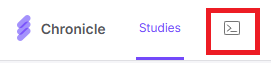

# Chronicle Android Bulk Data Downloader

A tool for downloading Chronicle Android data in bulk. Not affiliated with Chronicle or GetMethodic.

**Please do not lower or remove the rate limiting.**

## About the Application

This application provides a GUI interface for downloading data from Chronicle studies, with features for:

- Downloading various types of Chronicle data (raw usage events, preprocessed data, surveys, time use diaries)
- Filtering participants by ID (inclusive or exclusive)
- Organizing and archiving downloaded data

## Usage

1. Select the download folder
2. Paste the token you copied from the Chronicle GetMethodic website, located here:
   

4. Enter a valid Chronicle study ID
5. Optionally provide participant IDs to filter (separated by commas)
   - a. Exclusive filtering (default) excludes the IDs that you list
   - b. Inclusive filtering (when checkbox is checked) only downloads the IDs that you listed
4. Check which data types to download
5. Click the "Run" button
